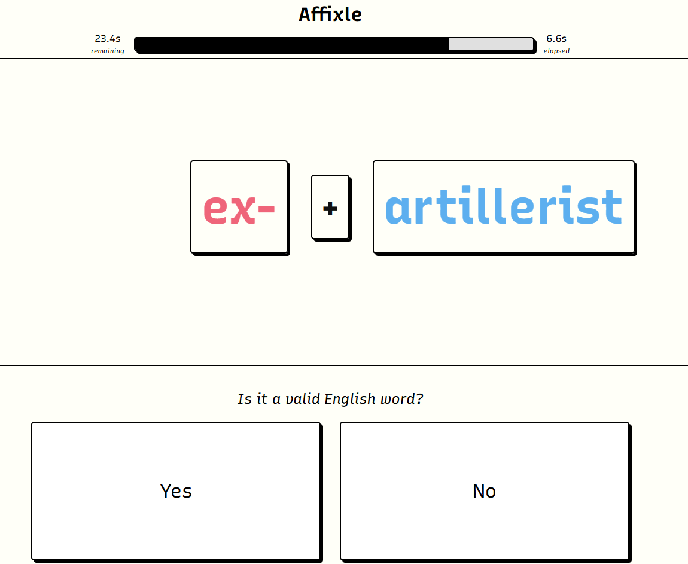
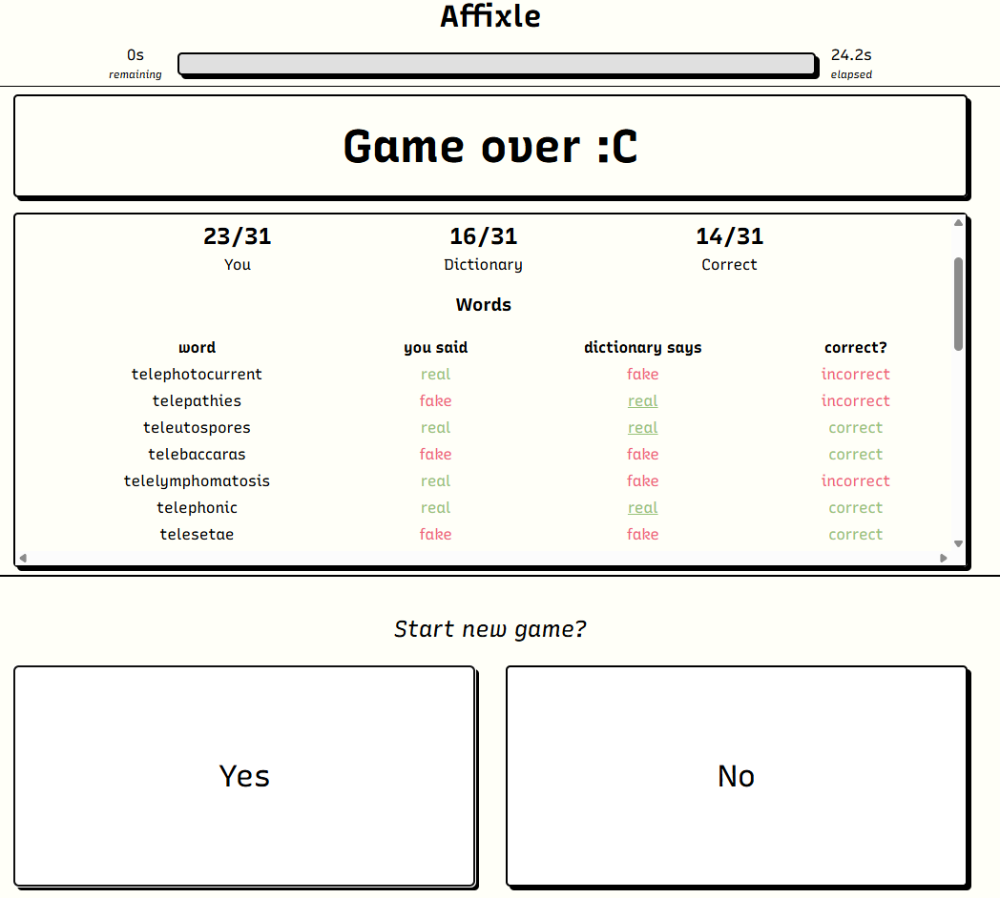

# **Affixle**

Affixle is a fast-paced word game that gives you either a prefix or a suffix
along with a base word and you have to say whether or not the combined phrase
given is an actual word in the scrabble dictionary or a made up word. It's a
time attack game where you play until the time runs out and you are given your
final score.



The game logic and dictionary lookups run in C++ compiled to WASM via
Emscripten, exposed to a Svelte frontend.

> [!NOTE]
> This game used to be called "Prefix Processor" in development if you see that
> name around

# Gameplay Loop

1. You're shown something like un + happy or trans + bucket
2. Tap Yes if you think the prefix + base makes a real word, and No if you
   don't.
3. Correct answers add time to the clock, wrong answers deduct time.
4. The game ends when the timer hits zero

> [!TIP]
> **Play it at <https://thestarviper.github.io/Prefix-Processor/>!**

# Backend (C++)

ok so basically how i went about developing the backend is just by creating a
ton of helper functions to update and fetch the data in the backemd. The backend
loads the dictionary of words and creates the questions and holds the past
failures and successes so that the frontend can just run a function to fetch the
data pre-calculated. the file in backend/src/exposed_functions.md has all the
functions documented so that ethmarks knows how each function works, the
parameters it takes, and what it returns.

### Linkage

We used [Emscripten](https://emscripten.org/) to compile the C++ backend to WASM
and JS that can run in the browser. The frontend can then access the functions
via importing them. Void functions can be run directly, but functions that take
params or return a value need to be wrapped with `Module.cwrap()` before they
can be used.

# Frontend (Svelte)



Here's what all the important files in the frontend do:

- `+page.svelte`: the main page. It does some high-level orchestrator logic and
  also includes the various components.
- `Compound.svelte`: this is the component that displays the "prefix + word"
  combo in the center of the screen.
- `Timer.svelte`: this is the component that displays the timer at the top of
  the screen. The progress bar is worth 30 seconds, and if the user ever has
  more than 30 seconds of time remaining, it splits into multiple progress bars,
  each worth 30 seconds.
- `YesNo.svelte`: this is the component with the yes and no buttons at the
  bottom of the screen.
- `GameOver.svelte`: this is the component that displays the postgame breakdown
  in the center of the screen once the timer runs out. The word breakdown is an
  html table, generated from the output of `getAnswers()`.
- `cppManager.ts`: this script manages the emscripten bridge to the c++ backend,
  and also handles some of the logic for parsing the backend's output into a
  format that the rest of the frontend can easily consume.
- `timeManager.svelte.ts`: this script manages the timer. It tracks the elapsed
  time since the game start, and also tracks the seconds remaining.
- `sound.ts`: this script manages the sound. I copied it from
  [the last time I needed to do sound](github.com/ethmarks/hadronize/blob/main/src/lib/ui/sound.svelte.ts)

# **Assets**

- [Scrabble Dictionary](https://github.com/zeisler/scrabble/blob/master/db/dictionary.csv)

# Running Locally

Prerequisites:

- [pnpm](https://pnpm.io/installation)
- [emscripten](https://emscripten.org/docs/getting_started/downloads.html)

```sh
# clone the repo
git clone https://github.com/TheStarViper/Prefix-Processor.git
cd Prefix-Processor

# regenerate the wasm (technically optional)
make -C backend

# start the site
cd frontend
pnpm install
pnpm dev
```

# **Contributers**

- Ethan ([@ethmarks](https://github.com/ethmarks)): Frontend in Svelte
- Andrew ([@TheStarViper](https://github.com/TheStarViper)): Backend in C++
